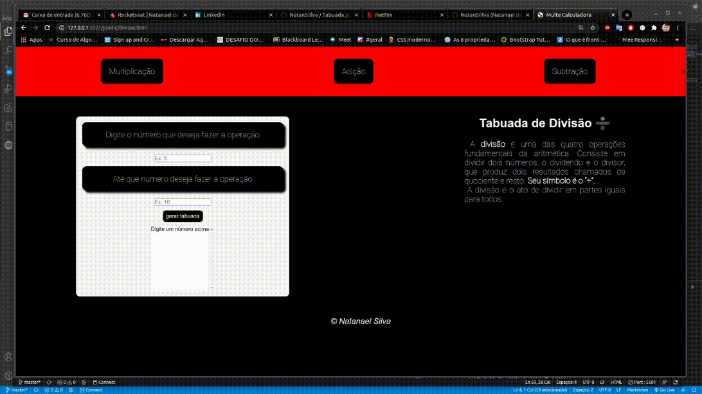

# Tabuada

## 📚 Página

 
 É uma pagina em HTML e CSS, onde temos a possibilidade de fazer diversar operações aritmética por <strong> Ex:  +,-,/ e * </STRONG> assim escolhedo ate que número a operção venha se repetir.

 <h1 align = center>
    
</h1>

  ## 💻 Tecnologias utilizadas
  - HTML
  - CSS
  - JavaScript
  

 
 

🐱‍👤 Desenvolvido por Natanael Silva 